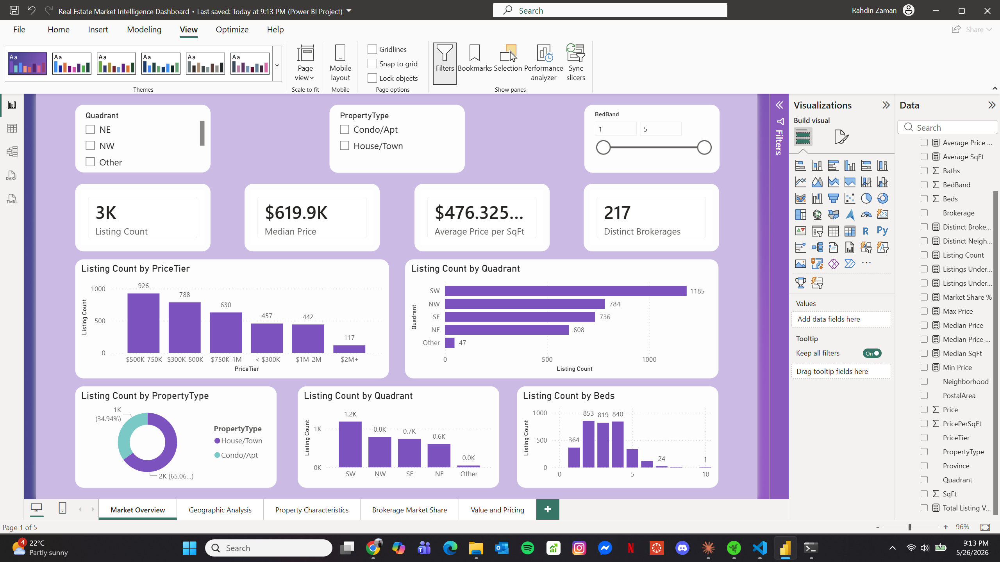
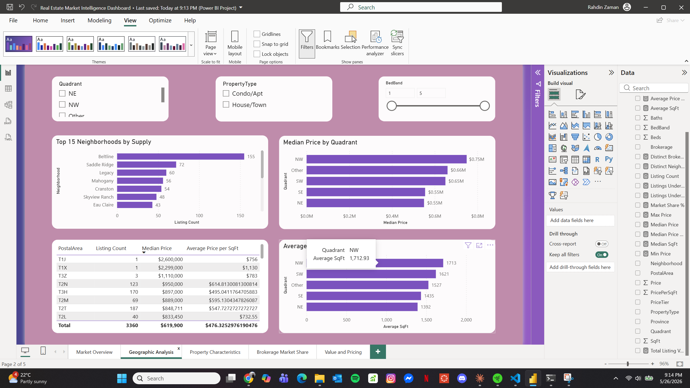
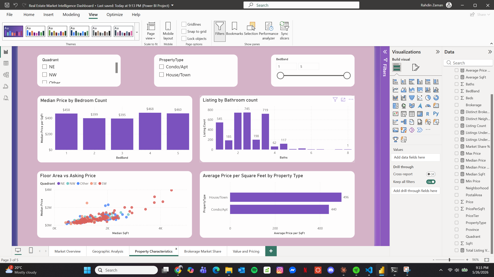
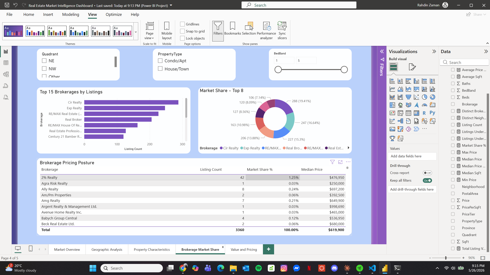
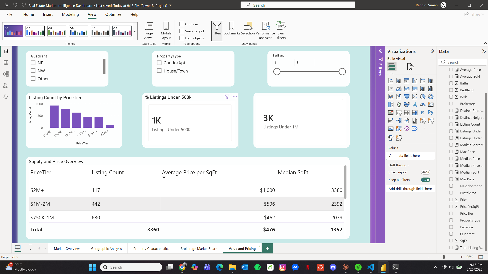

# Calgary Residential Market Intelligence — Power BI Dashboard

An end-to-end analytics-engineering project that turns a raw dataset of **3,360 Calgary
residential listings** into an interactive, multi-page **Power BI** report for pricing,
supply, and value analysis. Built to mirror an enterprise raw-data → semantic-model →
dashboard workflow.

> **Tools:** Python (pandas) · Power BI Desktop · DAX
> **Scope:** feature engineering · semantic data modeling · 17 DAX measures · 5-page interactive report

### 🔗 [**View the live dashboard →**](https://app.powerbi.com/groups/me/reports/34da9d1b-e987-4a78-af6a-e29cd85e5f08/4c62789d489abac784ba?experience=power-bi)

_Published to the Power BI Service. Viewing may require sign-in and access permissions._

---

## 📊 Dashboard Preview

> _Add your screenshots to a `/screenshots` folder and update the paths below._
> _Recruiters usually can't open a `.pbix`, so these images are what most people will actually see._

| Market Overview | Geographic Analysis |
|---|---|
|  |  |

| Property Characteristics | Brokerage Market Share | Value & Pricing |
|---|---|---|
|  |  |  |

---

## Overview

The source data contained unstructured fields (full address strings, embedded postal codes,
free-text brokerage names) that weren't usable for analysis as-is. This project:

1. **Engineers analytical dimensions** from the raw fields in Python.
2. **Models** the result into a clean, typed semantic layer.
3. **Surfaces** it through a 5-page Power BI report with cross-filtering, KPI cards, and
   drillable charts — designed to support residential investment screening.

**Dataset at a glance**

| Metric | Value |
|---|---|
| Listings | 3,360 |
| Modeled columns | 14 |
| DAX measures | 17 |
| Report pages | 5 |
| Neighbourhoods | 309 |
| Brokerages | 217 |
| Postal areas (FSA) | 45 |
| City quadrants | 5 |

---

## Report Pages

- **Market Overview** — headline KPIs (listing count, median price, avg $/sq.ft,
  neighbourhood count), price-band distribution, supply by quadrant, and property-type split.
- **Geographic Analysis** — listings and median price by neighbourhood, quadrant, and postal
  area (FSA); most-expensive vs. best-value areas.
- **Property Characteristics** — price by bedroom count, bathroom distribution, and a
  floor-area-vs-price scatter coloured by quadrant.
- **Brokerage Market Share** — listing concentration and pricing posture across 217 brokerages.
- **Value & Pricing** — price tiers, affordability thresholds, and $/sq.ft outliers for
  investment screening.

All pages share **slicers** (Quadrant · Property Type · Bedrooms) that cross-filter every visual.

---

## Data & Methodology

Feature engineering performed in Python (`pandas`) before modeling:

| Engineered field | Derived from | Purpose |
|---|---|---|
| `Quadrant` | address suffix (SW/NW/SE/NE) | Calgary geographic segmentation |
| `PostalArea` (FSA) | postal code prefix | Finer-grained location rollup |
| `PropertyType` | presence of unit number in address | Condo/Apt vs. House/Town |
| `PricePerSqFt` | Price ÷ SqFt | Normalized value comparison |
| `PriceTier` | Price banding | Affordability / segment analysis |
| `BedBand` | bedroom bucketing | Cleaner categorical axis |

---

## Semantic Model & DAX

A single `Listings` fact table with 14 typed, formatted columns and **17 reusable measures**, including:

```DAX
Listing Count        = COUNTROWS('Listings')
Median Price         = MEDIAN('Listings'[Price])
Average Price per SqFt = AVERAGE('Listings'[PricePerSqFt])
Market Share %       = DIVIDE([Listing Count], CALCULATE([Listing Count], ALLSELECTED('Listings')))
% Listings Under 500K = DIVIDE(
                            CALCULATE([Listing Count], 'Listings'[Price] <= 500000),
                            [Listing Count])
```

_(Full measure list lives in the `.pbip` / model files.)_

---

## Tech Stack

- **Python** — `pandas` for data cleaning and feature engineering
- **Power BI Desktop** — semantic modeling, DAX, report design
- **DAX** — reusable measures (medians, ratios, market share, affordability)

---

## Repository Structure

```
.
├── data/
│   └── Calgary_Listings_Modeled.csv     # cleaned, modeled dataset
├── src/
│   └── feature_engineering.py           # raw → modeled transformation
├── powerbi/
│   └── CalgaryMarketIntelligence.pbix    # (or .pbip project folder)
├── screenshots/
│   └── *.png                             # dashboard page captures
└── README.md
```

> Tip: for clean, reviewable version control, export from Power BI Desktop with
> **File ▸ Save as ▸ Power BI project (`.pbip`)** and commit that folder — the model (TMDL)
> and report definition are text-based and diff-able on GitHub.

---

## How to Reproduce

1. (Optional) Re-run feature engineering: `python src/feature_engineering.py`
2. Open the `.pbix` (or `.pbip`) in **Power BI Desktop**.
3. If prompted for the data source, point it at `data/Calgary_Listings_Modeled.csv`.

---

## About

Self-directed project demonstrating the full analytics-engineering pipeline — from raw,
unstructured data to a decision-ready BI product. Built as part of my preparation for an
Analytics Engineering co-op.

_Data: publicly available Calgary residential listings. For learning/portfolio use._
